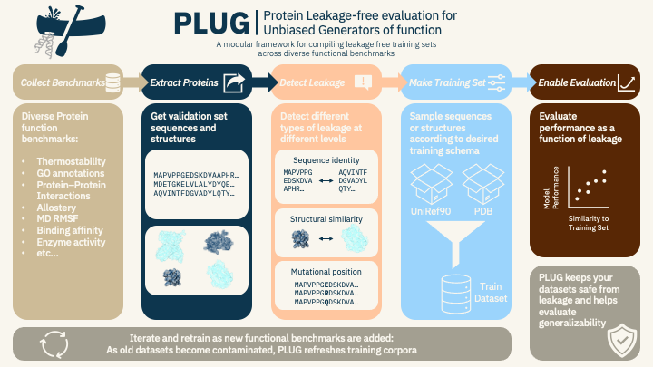

# PLUG

**Protein Leakage-free evaluation for Unbiased Generators of function.**



build a **leakage-free** training subset — sampled from a sequence reservoir (uniref90), a structure reservoir (pdb), or both — to align/train a protein model on, then test whether alignment improves prediction on functional benchmarks (thermompnn ddG, proteingym dms fitness, bioreason-pro GO function, allobench + passerrank allosteric sites, human PPI, pdbbind/bindingdb affinity, atlas MD per-residue RMSF, and whatever else you want).

leakage rule: a sampled candidate is dropped if it looks like any **test** protein —
- **sequence** (`RESERVOIR=seq`, uniref90): mmseqs2 alignment over >80% of a test seq's length at >20% identity (`COV`/`MIN_ID`), so the test protein's content is present in the train seq.
- **structure** (`RESERVOIR=struct`, pdb): foldseek TMalign at >0.5 TM-score to a test structure (`TM`), i.e. the same fold.
- **both** (`RESERVOIR=both`): a union graph over the sequence and structure hits — a candidate is dropped if its component touches a test protein in *either* view, so a seq+struct model is safe against leakage through either lens.

thresholds/params are deliberately user-defined so you can characterize generalizability as a function of how much leakage you allow.

## leakage coverage modes (`COV_MODE`)

mmseqs `--cov-mode` decides which sequence the `COV` (0.8) threshold applies to, which matters for **multidomain** proteins:

- `COV_MODE=1` (default) — cover the **test** seq. drops a train seq if it covers >80% of a test protein *regardless of the train protein's length*, so it catches a long multidomain uniref protein that contains a whole test protein as one domain. the leakage-faithful choice.
- `COV_MODE=0` — cover **both** seqs (>80% of each). only removes near-duplicates of similar length; it would **keep** the multidomain protein above (the test domain is <80% of the long train seq), letting a test protein leak in as a sub-domain.
- `COV_MODE=2` — cover the **train** seq. catches the reverse (a short train protein that is a sub-domain of a longer test protein).

for example: a 600 aa uniref protein whose 200 aa domain B equals a 200 aa test protein — the alignment covers 100% of the test but only 33% of the train seq, so `COV_MODE=1` flags it (removed) while `COV_MODE=0` keeps it.

## usage pipeline
to create your own leakage-free training set:

```
data/download_*.sh    download a benchmark's test set            -> data/<bench>/
format_benchmark.py   each test set -> uniform fasta             -> data/formatted/<bench>.fasta
build_trainset.py     sample a reservoir, drop leakers, repeat   -> trainset.fasta
datasets.py           load trainset + benchmarks as torch datasets
```

instead of scanning a whole reservoir (~121M uniref90 seqs, or the whole pdb), `build_trainset.py` **reservoir-samples** a batch of candidates in one streaming pass — the reservoir is never held in memory — checks *every* sampled candidate against the (small) test sets, keeps the clean ones, and resamples until the quota is met:

- **sequence scan** (`RESERVOIR=seq`): stream the uniref90 fasta, sample a batch, `mmseqs` them against the combined test fastas, and drop any that clear the identity + coverage cutoff.
- **structure scan** (`RESERVOIR=struct`): stream the pdb directory, sample a batch of structures, `foldseek` TMalign them against the test structures, and drop any that clear the TM-score cutoff.
- **both** (`RESERVOIR=both`): sample structures, run *both* searches on them (their sequences come straight out of the structures), and drop via a union graph — any candidate whose sequence *or* structure neighborhood reaches a test protein is removed. the result is leakage-proof for a model that sees sequence and structure together.

checking a small sample against the tiny test sets is cheap and exact; the reservoir is never copied, only the sampled training set is written. sampling is uniform (to cover lengths and families) but could be stratified on a feature (composition, family, fold, organism, …).

## setup

the reservoirs are downloaded separately — point `.env` at them (and at the search binaries). copy `.env.example` to `.env` and edit; `config.py` auto-loads it. then:

```bash
uv sync                                  # create .venv with core deps (add --extra torch for datasets.py)
source .venv/bin/activate                # then plain `python ...` uses the venv
for s in data/download_*.sh; do sh "$s"; done   # fetch every benchmark's test set
```

- **sequence reservoir**: uniref90 (https://ftp.uniprot.org/pub/databases/uniprot/uniref/uniref90/), point `UNIREF_FASTA` at it. needs mmseqs2 — set `MMSEQS` (or `brew install mmseqs2`).
- **structure reservoir**: a directory of pdb/mmcif files — `sh data/download_pdb.sh` mirrors the whole pdb into `data/pdb`, point `PDB_DIR` at it. needs foldseek — grab the static build for your platform from https://github.com/steineggerlab/foldseek/releases (`foldseek-osx-universal.tar.gz`, `foldseek-linux-avx2.tar.gz`, `foldseek-linux-arm64.tar.gz`, or `foldseek-linux-gpu.tar.gz`), untar it, and point `FOLDSEEK` at the extracted `bin/foldseek`. structural leakage also needs the test-set structures in `STRUCT_TESTS` (a dir of pdb/mmcif files).
- for the gpu check, point `MMSEQS`/`FOLDSEEK` at gpu builds and set `GPU=1`.

## run

```bash
python src/format_benchmark.py           # all benchmarks -> data/formatted/*.fasta
RESERVOIR=seq   python src/build_trainset.py   # sample uniref90, drop sequence leakers -> trainset.fasta
RESERVOIR=struct python src/build_trainset.py  # sample the pdb, drop TM-score leakers
RESERVOIR=both  python src/build_trainset.py   # sample the pdb, drop union (seq ∪ struct) leakers
```

`.env` controls it: `RESERVOIR` picks seq/struct/both, `QUOTA` is how many leakage-free seqs to collect, `OVERSAMPLE` how much extra to draw each round to cover dropped leakers, `MIN_LEN`/`MAX_LEN` bound the sampled protein length (drops fragments + giant non-physiological seqs), `MIN_ID`/`TM` are the sequence/structure leakage thresholds, `GPU=1` runs the check on a cuda gpu.

## use

needs torch (`uv sync --extra torch`), with the venv activated:

```python
import sys; sys.path.insert(0, "src")
from datasets import (TrainSet, DdgDataset, DmsDataset, GoDataset,
                      AllobenchDataset, PpiDataset, Shs27kDataset, PasserrankDataset,
                      PdbbindDataset, BindingdbDataset, AtlasDataset)

train = TrainSet()                         # {sequence, id} — the leakage-free align set (id = uniprot code)
ddg   = DdgDataset(dataset="megascale")    # {sequence, mutation, ddg, pdb, dataset}
dms   = DmsDataset(assay="Binding")        # {sequence, mutation, score, assay, dms_id, uniprot}
go    = GoDataset()                         # {sequence, protein_id, organism, go_bp, go_mf, go_cc}
allo  = AllobenchDataset()                  # {sequence, target_id, gene, organism, uniprot, allosteric_site, active_site}
ppi   = PpiDataset(level=0)                 # {sequence_a, sequence_b, id_a, id_b, label, level}
shs   = Shs27kDataset(mode="binding")      # {sequence_a, sequence_b, id_a, id_b, types, score} — STRING PPI subset
pr    = PasserrankDataset()                 # {sequence, uniprot, gene, organism, pdb, allosteric_site}
pdb   = PdbbindDataset()                    # {sequence, pdb, value, smiles, split} — LP-PDBBind affinity, test split
bdb   = BindingdbDataset()                  # {sequence, uniprot, target_name, organism, smiles, measure, value, relation}
atlas = AtlasDataset()                      # {sequence, pdb_chain, rmsf, rmsf_replicas} — per-residue MD flexibility (Å)
```

## datasets

| benchmark | source | unique test seqs |
|---|---|---|
| ddg | thermompnn megascale + fireprot | 28,227 |
| dms | proteingym DMS_substitutions | 187 |
| go  | bioreason-pro (cafa5 temporal holdout) | 8,528 |
| allobench | allobench allosteric/active sites | 425 |
| ppi | human ppi gold standard (figshare) | 11,019 |
| shs27k | STRING human PPI subset (GNN-PPI / PIPR) | 1,690 |
| passerrank | passerrank allosteric set (ASD) | 333 |
| pdbbind | LP-PDBBind protein–ligand affinity (test split) | 2,644 |
| bindingdb | bindingdb articles, protein–ligand affinity (single-chain targets) | 2,157 |
| atlas | atlas MD per-residue RMSF (conformational dynamics) | 1,693 |

reservoirs: uniref90 (~121M sequences) and the pdb (~all deposited structures, as a directory of mmcif files).

## licenses

while this repo doesn't distribute actual data, it is important to review
[`licenses/`](licenses/) for the full texts and an attribution index. all sources are freely redistributable
with attribution **except atlas (CC BY-NC) and lp-pdbbind (research/non-profit only)**, which are
non-commercial. the generated trainset (uniref90 CC BY + pdb CC0) is clean for any use, with attribution.

## adding a benchmark

1. add `data/download_<name>.sh` to fetch its test set.
2. add an adapter to `ADAPTERS` in `src/format_benchmark.py` (name -> fn yielding its test seqs),
   then `python src/format_benchmark.py <name>`.
3. `python src/build_trainset.py` — the sample is checked against every `data/formatted/*.fasta`
   (and, for `RESERVOIR=struct|both`, every structure in `STRUCT_TESTS`), so the new benchmark is
   protected automatically.


## TODO:
- add other sampling strategies for train set (stratify on length/family/fold/organism/…)
- add more benchmarks (more conformational/functional signals)
- fetch each benchmark's test structures automatically for the foldseek check
